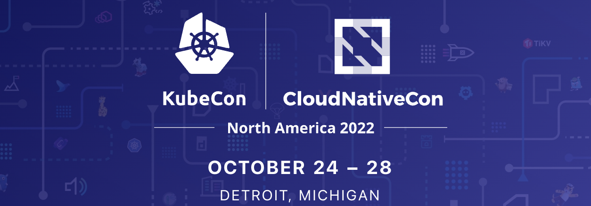

# How To Build Production Grade DevOps Platform Using Argoproj



## Preparation

1. Follow the getting started guide steps to install Argo CD:

```
kubectl create namespace argocd
kubectl apply -n argocd -f https://raw.githubusercontent.com/argoproj/argo-cd/v2.2.15/manifests/install.yaml
```

2. Configure Argo CD to start managing itself:

```
kubectl apply -f https://raw.githubusercontent.com/kubecon-us-2022-argo/control-plane/main/argo-cd/argocd-app.yaml -n argocd
```

3. Expose Argo CD UI and access it via https://localhost:8080:


```
kubectl port-forward svc/argocd-server 8080:443 -n argocd
```

## Onboarding a team

### Multi-Tenancy

In order to onboard a team we need to create a project that specifies team's OIDC group, list of source Git repositories and list of destination Kubernetes clusters with namespaces.
The application developer team can self-oboard by forking the repository and creating a pull request that introcuces a new project.

```yaml
apiVersion: argoproj.io/v1alpha1
kind: AppProject
metadata:
  name: team-a
spec:
  sourceRepos:
    - https://github.com/argoproj/argocd-example-apps
  destinations:
    - namespace: team-a-*
      server: https://kubernetes.default.svc
  roles:
  - name: admin
    policies:
    - p, proj:team-a:admin, *, *, team-a/*, allow
    groups:
    - AMatyushentsev@gmail.com
```

Once the project is create the team have permissions to manage applications in the project. Speaking of scalability, you might notice that each
project is managed in a separate file and fully self-contained. This really helps to avoid merge conflicts which is very improtant for a large scale.

### Cluster Level Resources

The team has permissions to create applications in the project however namespaces are still missing. Namespace is a cluster level resource and we cannot
just give permissions to create namespaces to the team. The problem is very similar to the problem of creating a project and we can leverage the GitOps again.

The only difference is that in real life Argo CD manages multple clusters. The problem is that one Argo CD application can target only one Kubernetes cluster and
we don't want to manually create Argo CD application per cluster. Luckelly there is a solution to automate it as well and so we could keep using pure GitOps process
to streamline cluster resource management as well.

The solution is ApplicationSet custom resource that automates Argo CD application creation. Let's introduce a convention to store cluster resources under `clusters` directory
where each sub-directory represents a cluster:

```
.
├── argo-cd
│   ├── argocd-app.yaml
│   ├── argocd-cm.yaml
│   ├── argocd-rbac-cm.yaml
│   └── projects
│       └── team-a.yaml
├── clusters
│   └── in-cluster
│       └── team-a.yaml
```

Each team has a separate file that defines namespaces and any other cluster resources (such as cluster role, role binding etc) that they need.

The following ApplicationSet will be automatically creating an application when a new cluster directory is added. This would allow teams to even onboard
new clusters without asking for help from the Platform team.


```yaml
apiVersion: argoproj.io/v1alpha1
kind: ApplicationSet
metadata:
  name: cluster-resources
spec:
  generators:
  - git:
      repoURL: https://github.com/kubecon-us-2022-argo/control-plane
      revision: HEAD
      directories:
      - path: clusters/*
  template:
    metadata:
      name: 'cluster-{{path}}'
    spec:
      project: default
      source:
        repoURL: https://github.com/kubecon-us-2022-argo/control-plane
        targetRevision: HEAD
        path: '{{path}}'
      destination:
        server: '{{path}}'
      syncPolicy:
        automated: {}
```